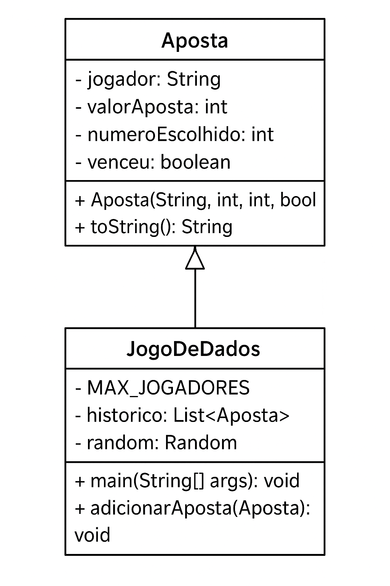
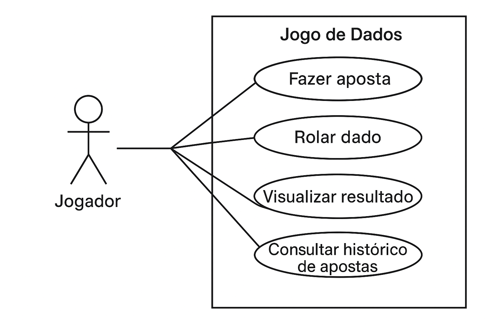

# Jogo de Dados 🎲

## Levantamento de Requisitos
- O sistema permite cadastrar até 11 jogadores.
- Cada jogador aposta em um número de 1 a 6.
- O jogo rola o dado e mostra o vencedor.
- O histórico das apostas é salvo em um arquivo de texto.

## Diagrama de Classes

## Diagrama de Casos de Uso

## Referências
- [Documentação oficial do GitHub](https://docs.github.com/pt)

---

**Repositório:** [Link do repositório no GitHub](https://github.com/gedeP1/JogoDeDado)
